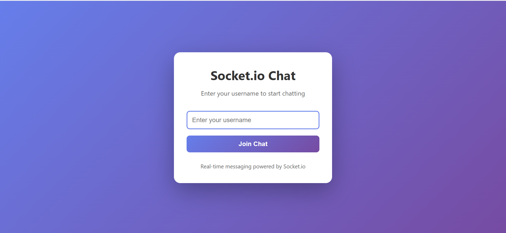
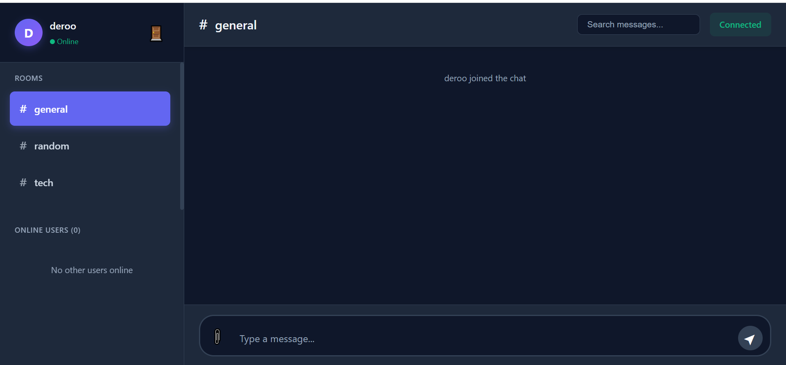
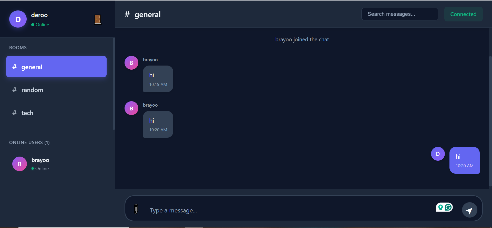
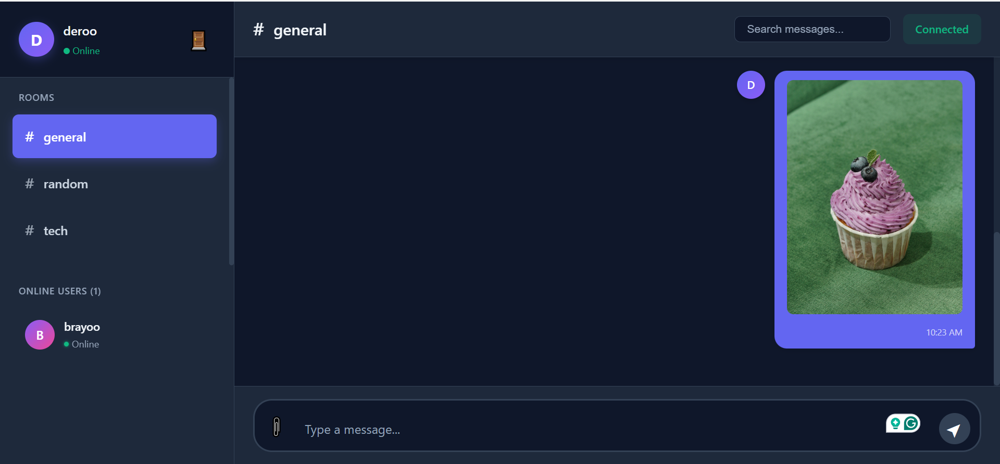
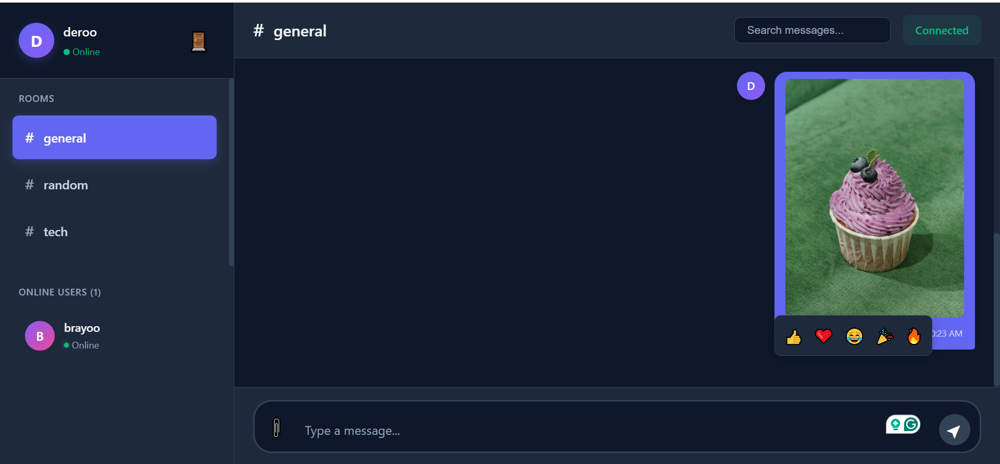
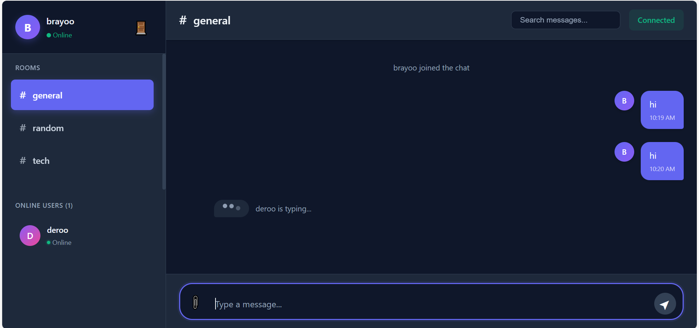

# 💬 Real-Time Chat Application with Socket.io

A full-featured, real-time chat application built with **Socket.io**, **React**, and **Node.js/Express**. This project demonstrates bidirectional communication, real-time notifications, and modern chat features for seamless user interaction.


---

## 📋 Table of Contents

- [Project Overview](#-project-overview)
- [Features](#-features)
- [Tech Stack](#-tech-stack)
- [Project Structure](#-project-structure)
- [Setup Instructions](#-setup-instructions)
- [Usage](#-usage)
- [Screenshots](#-screenshots)
- [API Documentation](#-api-documentation)
- [Deployment](#-deployment)
- [Contributing](#-contributing)
- [License](#-license)

---

## 🎯 Project Overview

This is a modern, feature-rich chat application that enables real-time communication between multiple users. Built as part of Week 5 assignment on Real-Time Communication with Socket.io, it showcases advanced features like private messaging, file sharing, message reactions, and typing indicators.

### Key Highlights

- **Real-time messaging** with instant delivery
- **Multiple chat rooms** for organized conversations
- **Private messaging** between users
- **File and image sharing** with preview
- **Message reactions** with emoji support
- **Typing indicators** for live feedback
- **Read receipts** to track message status
- **Auto-reconnection** for reliability
- **Responsive design** for all devices

---

## ✨ Features

### Core Features ✅

#### 1. Real-Time Messaging
- Instant message delivery using Socket.io WebSockets
- Bidirectional communication between clients and server
- Message acknowledgment and delivery confirmation
- Persistent connection with automatic reconnection

#### 2. User Authentication
- Username-based authentication system
- Username validation (3-20 characters)
- Session management via Socket.io
- Secure user identification

#### 3. Multiple Chat Rooms
- Three default rooms: **#general**, **#random**, **#tech**
- Easy room switching with visual indicators
- Room-specific message history
- Active room highlighting

#### 4. Online User Presence
- Real-time user list updates
- Online/offline status indicators
- User avatar generation
- Active user count display

#### 5. Typing Indicators
- Shows which users are currently typing
- Auto-timeout after 3 seconds of inactivity
- Works in both public rooms and private chats
- Multiple user support

### Advanced Features ✅

#### 6. Private Messaging
- One-on-one conversations with any online user
- Messages marked with 🔒 private indicator
- Separate conversation threads
- Click on user to initiate private chat

#### 7. File & Image Sharing
- Upload images and files (max 5MB)
- Image preview before sending
- In-chat image display
- File attachment indicators
- Supported formats: images, PDF, DOC, DOCX

#### 8. Message Reactions
- React to messages with emojis: 👍 ❤️ 😂 🎉 🔥
- Multiple reactions per message
- Reaction count display
- Hover to see reaction picker

#### 9. Read Receipts
- ✓✓ checkmark when message is read
- Track who read your messages
- Timestamp of when message was read
- Works in both rooms and private chats

#### 10. Notifications System
- **Desktop notifications** for new messages
- **Unread message counter**
- Only notifies when window is not focused
- Browser notification permission integration

#### 11. Message Search
- Search through message history
- Real-time search results
- Filter by keyword
- Highlights matching messages

#### 12. Auto-Reconnection
- Automatic reconnection on disconnect
- Exponential backoff strategy
- Up to 10 reconnection attempts
- Visual reconnection indicator
- Preserves session on reconnect

### User Experience Features

- **Smooth animations** for messages and transitions
- **Loading states** for better feedback
- **Error handling** with user-friendly messages
- **Responsive design** for mobile, tablet, and desktop
- **Accessible UI** with proper contrast and semantics
- **Keyboard shortcuts** (Enter to send)

---

## 🛠️ Tech Stack

### Frontend
- **React** (v18.2.0) - UI framework
- **Socket.io Client** (v4.6.1) - Real-time communication
- **Vite** (v5.0.8) - Build tool and dev server
- **CSS3** - Styling with CSS variables

### Backend
- **Node.js** (v18+) - Runtime environment
- **Express** (v4.18.2) - Web framework
- **Socket.io** (v4.6.1) - WebSocket library
- **CORS** (v2.8.5) - Cross-origin resource sharing
- **dotenv** (v16.0.3) - Environment configuration

### Development Tools
- **Nodemon** (v3.0.1) - Auto-restart server
- **ESLint** - Code linting
- **Git** - Version control

---

## 📂 Project Structure

```
real-time-communication-with-socket-io/
│
├── server/                          # Node.js Backend
│   ├── server.js                    # Main server file with Socket.io setup
│   ├── package.json                 # Server dependencies
│   ├── .env                         # Environment variables
│   └── .env.example                 # Example environment file
│
├── client/                          # React Frontend
│   ├── public/                      # Static files
│   ├── src/
│   │   ├── components/              # React components
│   │   │   ├── Login.jsx            # Login page component
│   │   │   ├── Login.css            # Login styles
│   │   │   ├── ChatRoom.jsx         # Main chat interface
│   │   │   ├── ChatRoom.css         # Chat room styles
│   │   │   ├── Sidebar.jsx          # Navigation sidebar
│   │   │   ├── Sidebar.css          # Sidebar styles
│   │   │   ├── MessageList.jsx      # Message display component
│   │   │   ├── MessageList.css      # Message list styles
│   │   │   ├── MessageInput.jsx     # Message input component
│   │   │   └── MessageInput.css     # Input styles
│   │   ├── socket/
│   │   │   └── socket.js            # Socket.io client setup
│   │   ├── App.jsx                  # Main app component
│   │   ├── App.css                  # Global styles
│   │   └── main.jsx                 # Entry point
│   ├── package.json                 # Client dependencies
│   ├── vite.config.js               # Vite configuration
│   ├── .env                         # Environment variables
│   └── .env.example                 # Example environment file
│
├── .gitignore                       # Git ignore rules
└── README.md                        # This file
```

---

## 🚀 Setup Instructions

### Prerequisites

Before you begin, ensure you have the following installed:
- **Node.js** (v18 or higher) - [Download here](https://nodejs.org/)
- **npm** or **yarn** package manager
- **Git** - [Download here](https://git-scm.com/)
- Modern web browser (Chrome, Firefox, Safari, Edge)

### Installation Steps

#### 1. Clone the Repository

```bash
git clone https://github.com/PLP-MERN-Stack-Development/real-time-communication-with-socket-io-Goofy-collab.git
cd real-time-communication-with-socket-io-Goofy-collab
```

#### 2. Set Up Server

```bash
# Navigate to server directory
cd server

# Install dependencies
npm install

# Create .env file
cat > .env << EOF
PORT=5000
CLIENT_URL=http://localhost:5173
NODE_ENV=development
EOF
```

#### 3. Set Up Client

```bash
# Navigate to client directory (from project root)
cd ../client

# Install dependencies
npm install

# Create .env file
cat > .env << EOF
VITE_SOCKET_URL=http://localhost:5000
EOF
```

#### 4. Start the Application

**Terminal 1 - Start Server:**
```bash
cd server
npm run dev
```

Expected output:
```
Server running on port 5000
Available rooms: general, random, tech
```

**Terminal 2 - Start Client:**
```bash
cd client
npm run dev
```

Expected output:
```
VITE v5.0.8  ready in 500 ms

➜  Local:   http://localhost:5173/
➜  Network: use --host to expose
```

#### 5. Access the Application

Open your browser and navigate to:
```
http://localhost:5173
```

You should see the login page! 🎉

---

## 💡 Usage

### Getting Started

1. **Login**: Enter a username (3-20 characters) and click "Join Chat"
2. **Send Messages**: Type in the input box at the bottom and press Enter
3. **Switch Rooms**: Click on different room names (#general, #random, #tech)
4. **Private Chat**: Click on any user in the "Online Users" list
5. **Upload Files**: Click the 📎 button to attach images or files
6. **React to Messages**: Hover over any message to see reaction options
7. **Search Messages**: Use the search bar at the top to find specific messages

### Testing with Multiple Users

To test real-time features:

1. Open the app in **two different browser windows** (or use incognito mode)
2. Login with different usernames in each window
3. Send messages and see them appear instantly in both windows
4. Try private messaging, typing indicators, and reactions

---

## 📸 Screenshots

### Login Page

*Clean and modern login interface with username validation*

### Main Chat Interface

*Full chat interface with sidebar, message list, and input area*

### Multiple Rooms

*Switch between different chat rooms seamlessly*

### Private Messaging

*One-on-one conversations with private message indicator*

### File Sharing

*Upload and share images and files with preview*

### Message Reactions

*React to messages with emoji reactions*

### Typing Indicator

*Real-time typing indicators for active users*

---

## 📡 API Documentation

### REST API Endpoints

#### GET `/api/health`
Returns server health status and statistics.

**Response:**
```json
{
  "status": "ok",
  "users": 5,
  "rooms": 3,
  "timestamp": "2025-10-29T12:00:00.000Z"
}
```

#### GET `/api/messages/:room`
Get message history for a specific room.

**Response:**
```json
{
  "room": "general",
  "messages": [...],
  "count": 42
}
```

#### GET `/api/users`
Get list of all online users.

**Response:**
```json
{
  "users": [...],
  "count": 5
}
```

#### GET `/api/rooms`
Get information about all chat rooms.

**Response:**
```json
{
  "rooms": [
    {
      "name": "general",
      "users": 3,
      "messages": 42
    }
  ]
}
```

### Socket.io Events

#### Client → Server Events

| Event | Payload | Description |
|-------|---------|-------------|
| `user_join` | `username` | Register user when joining |
| `join_room` | `room` | Join a specific chat room |
| `send_message` | `{ message, file, room }` | Send a message |
| `private_message` | `{ to, message, file }` | Send private message |
| `typing` | `isTyping` | Update typing status |
| `message_read` | `{ messageId, room }` | Mark message as read |
| `add_reaction` | `{ messageId, emoji, room }` | Add reaction to message |

#### Server → Client Events

| Event | Payload | Description |
|-------|---------|-------------|
| `user_list` | `users[]` | Updated list of online users |
| `user_joined` | `user` | User joined notification |
| `user_left` | `user` | User left notification |
| `receive_message` | `message` | New message received |
| `private_message` | `message` | New private message |
| `typing_users` | `{ room, users[] }` | Users currently typing |
| `message_delivered` | `{ id, timestamp }` | Message delivery confirmation |
| `message_read_receipt` | `{ messageId, readBy, readAt }` | Message read confirmation |
| `reaction_added` | `{ messageId, emoji, username }` | Reaction added to message |

---

## 🚢 Deployment

### Deploy Server (Railway/Render)

1. Push your code to GitHub
2. Sign up at [Railway.app](https://railway.app) or [Render.com](https://render.com)
3. Create a new project and connect your GitHub repository
4. Set environment variables:
   ```
   PORT=5000
   CLIENT_URL=https://your-client-url.com
   NODE_ENV=production
   ```
5. Deploy!

### Deploy Client (Vercel/Netlify)

1. Sign up at [Vercel.com](https://vercel.com) or [Netlify.com](https://netlify.com)
2. Connect your GitHub repository
3. Set build settings:
   - **Build Command:** `npm run build`
   - **Output Directory:** `dist`
   - **Root Directory:** `client`
4. Set environment variable:
   ```
   VITE_SOCKET_URL=https://your-server-url.com
   ```
5. Deploy!


---

## 🧪 Testing

### Manual Testing Checklist

- [ ] User can login with valid username
- [ ] Messages send and receive in real-time
- [ ] Can switch between chat rooms
- [ ] Private messaging works correctly
- [ ] Typing indicators appear and disappear
- [ ] File upload works (images and documents)
- [ ] Message reactions can be added
- [ ] Read receipts show for read messages
- [ ] Notifications appear when window not focused
- [ ] Auto-reconnection works after disconnect
- [ ] Message search filters correctly
- [ ] Application is responsive on mobile devices

### Browser Compatibility

Tested and working on:
- ✅ Chrome (latest)
- ✅ Firefox (latest)
- ✅ Safari (latest)
- ✅ Edge (latest)
- ✅ Mobile browsers (iOS Safari, Chrome Mobile)

---

## 🤝 Contributing

Contributions are welcome! Please follow these steps:

1. Fork the repository
2. Create a feature branch (`git checkout -b feature/AmazingFeature`)
3. Commit your changes (`git commit -m 'Add some AmazingFeature'`)
4. Push to the branch (`git push origin feature/AmazingFeature`)
5. Open a Pull Request

---

## 📄 License

This project is licensed under the MIT License - see the [LICENSE](LICENSE) file for details.

---


## 🙏 Acknowledgments

- [Socket.io Documentation](https://socket.io/docs/)
- [React Documentation](https://react.dev/)
- [Express.js Documentation](https://expressjs.com/)
- Week 5 Assignment - Real-Time Communication with Socket.io
- All contributors and testers

---

## 📚 Resources

- [Socket.io Server API](https://socket.io/docs/v4/server-api/)
- [Socket.io Client API](https://socket.io/docs/v4/client-api/)
- [React Hooks Reference](https://react.dev/reference/react)
- [Vite Documentation](https://vitejs.dev/)

---

<div align="center">

**⭐ If you found this project helpful, please give it a star! ⭐**

Made with ❤️ using Socket.io, React, and Node.js

</div>